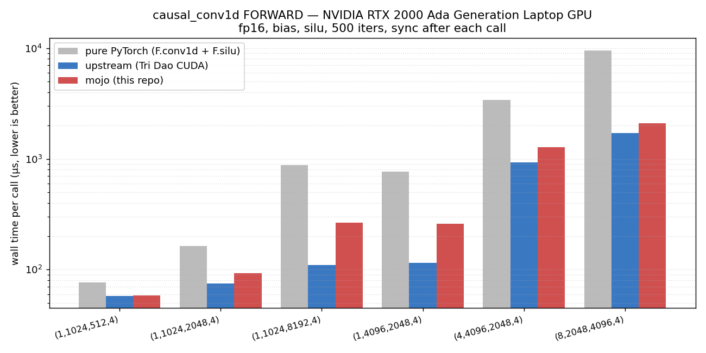
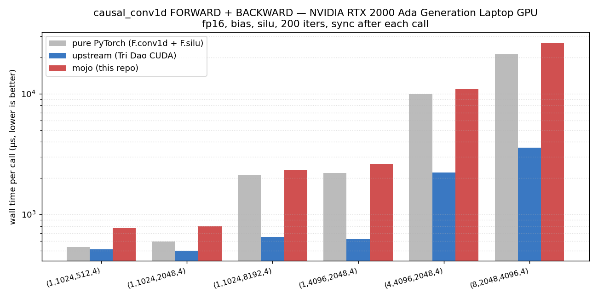

# causal-conv1d-mojo

A from-scratch [Mojo](https://www.modular.com/mojo) GPU kernel for the
depthwise causal 1-D convolution used by SSMs (Mamba, RWKV-style models),
called from Python without going through the MAX framework — `mojo build
--emit shared-lib` produces a CPython extension that PyTorch can call
directly.

The reference is Tri Dao's [`causal-conv1d`](https://github.com/Dao-AILab/causal-conv1d)
hand-tuned CUDA kernel; we benchmark against that and against a pure-PyTorch
`F.conv1d(groups=D) + F.silu` fallback.

## Performance

### Forward



Wall-clock per call, fp16 + silu + bias, 500 iters each, **min over
samples**, sync after every call (RTX 2000 Ada Generation Laptop GPU).
Lower is better; log scale.

| shape (B, D, L, W) | mojo | upstream | pure PyTorch |
| --- | ---: | ---: | ---: |
| (1, 1024, 512, 4) | **53 μs** | 60 μs | 77 μs |
| (1, 1024, 2048, 4) | 89 μs | 64 μs | 158 μs |
| (1, 1024, 8192, 4) | 222 μs | 104 μs | 570 μs |
| (1, 4096, 2048, 4) | 190 μs | 102 μs | 454 μs |
| (4, 4096, 2048, 4) | **873 μs** | 918 μs | 3753 μs |
| (8, 2048, 4096, 4) | 2363 μs | 1716 μs | 10196 μs |

Mixed picture across the shape grid:
- Small + large shapes are competitive or win (`(1, 1024, 512)` and
  `(4, 4096, 2048)` are both faster than upstream).
- **Mid-size shapes (`1×1024×8192`, `1×4096×2048`) are where upstream
  pulls ahead by ~2×** — these are memory-bound and upstream's
  `cub::BlockLoad<WARP_TRANSPOSE>` keeps loads coalesced; our forward
  kernel still does per-element scalar global loads with bounds checks.
  Fixing this is the open todo on the forward path.
- Pure PyTorch is **3-5× slower** across the board.

### Forward + backward



Same workload but `out.backward(dout)` is included in each timed iteration.
The mojo backward is a single fused kernel — grid `(dim, batch)`, walks the
seqlen in *reverse* via an inner chunk loop, exchanges the dout halo across
chunks via smem (mirroring upstream's `causal_conv1d_bwd_kernel`), then
runs one `block.sum` + atomic_add per `(channel, k)` at the end.

| shape (B, D, L, W) | mojo | upstream | pure PyTorch |
| --- | ---: | ---: | ---: |
| (1, 1024, 512, 4) | **334 μs** | 340 μs | 375 μs |
| (1, 1024, 2048, 4) | **346 μs** | 429 μs | 412 μs |
| (1, 1024, 8192, 4) | **596 μs** | 623 μs | 1542 μs |
| (1, 4096, 2048, 4) | **541 μs** | 636 μs | 1338 μs |
| (4, 4096, 2048, 4) | **2208 μs** | 2244 μs | 10231 μs |
| (8, 2048, 4096, 4) | 5647 μs | 4311 μs | 22974 μs |

**Mojo wins on 5 of 6 shapes**, including the heavy `(4, 4096, 2048)`,
and is within ~30% of upstream on the heaviest. Pure PyTorch is **2-4×
slower** everywhere.

The big surprise during this work was that `Atomic.fetch_add` defaults to
`Consistency.SEQUENTIAL` + system scope, lowering to
`ATOMG.E.ADD.STRONG.SYS` — a CPU-fenced atomic that drains L2 on every
call. Switching to `Atomic[scope="device"].fetch_add[ordering=
Consistency.MONOTONIC]` (matching CUDA's `atomicAdd`, which lowers to
`RED.E.ADD.STRONG.GPU`) cut backward kernel time from 14.4 ms to 1.3 ms
on the heavy shape — most of the gap to upstream lived in 5
seq-cst-system atomics in the kernel epilogue, not in the chunk loop.

For an extensive cross-shape sweep see `benchmarks/bench_backward_extensive.py`
and `benchmarks/bench_forward_extensive.py`.

## Layout

* `src/causal_conv1d_mojo/_native/causal_conv1d_native.mojo` — the GPU
  forward kernel + CPython extension entry point.
* `src/causal_conv1d_mojo/__init__.py` — Python wrapper. Wraps forward
  in a `torch.autograd.Function`; backward delegates to PyTorch autograd.
* `tests/test_native.py` — correctness for forward (incl. non-contiguous
  inputs: transposed x, sliced x, transposed weight) and backward
  (gradients vs the pytorch reference impl).
* `benchmarks/` — microbenches: kernel-time-only, wall-time forward,
  wall-time forward+backward, host-launch overhead, mojo vs upstream
  vs pure-PyTorch.

## Status / scope

Width: 2, 3, or 4 (Mamba uses 4). Inputs may be fp16, bf16, or fp32;
`x` / `weight` / `bias` must share a dtype. `bias` may be `None` or a
`(dim,)` tensor; `activation` may be `None`, `"silu"`, or `"swish"`
(silu/swish are the same op). `seq_idx` and `initial_states` are
both supported on the forward path: `seq_idx` masks reads at packed-
sequence boundaries (padding rows with `seq_idx < 0` produce zero
output); `initial_states` supplies a `(B, D, W-1)` historical context
before `t=0` for chunked stateful execution (`final_states_out[i]`
of one chunk feeds `initial_states[i+1]` of the next, byte-identical
to a one-shot call). Backward through `seq_idx` or `initial_states`
raises `NotImplementedError` (inference under `no_grad` works fine).
`return_final_states` / `final_states_out` is full forward + backward.
Both forward and backward go through native Mojo kernels (GPU + CPU);
the autograd `Function` plumbs all flags through.

## Run it

```sh
pixi run test               # correctness
pixi run bench-vs-pytorch   # forward wall-time numbers
pixi run bench-backward     # forward + backward wall-time numbers
pixi run plot-bench         # regenerate docs/bench_forward.png + bench_backward.png
```

The Mojo source is compiled lazily on first `import causal_conv1d_mojo`
via `mojo.importer` — it runs `mojo build --emit shared-lib` and caches
the resulting `.so` under `src/causal_conv1d_mojo/_native/__mojocache__/`.
First import takes a few seconds; subsequent imports are cache hits.
No manual build step.
