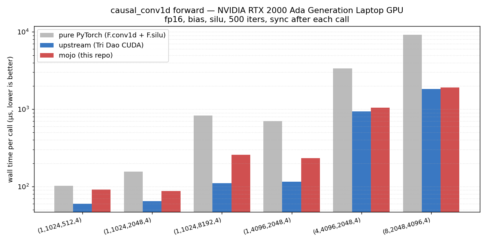

# causal-conv1d-mojo

A from-scratch [Mojo](https://www.modular.com/mojo) GPU kernel for the
depthwise causal 1-D convolution used by SSMs (Mamba, RWKV-style models),
called from Python without going through the MAX framework — `mojo build
--emit shared-lib` produces a CPython extension that PyTorch can call
directly.

The reference is Tri Dao's [`causal-conv1d`](https://github.com/Dao-AILab/causal-conv1d)
hand-tuned CUDA kernel; we benchmark against that and against a pure-PyTorch
`F.conv1d(groups=D) + F.silu` fallback.

## Performance



Wall-clock per call, fp16 + silu + bias, 500 iters each, sync after every
call (RTX 2000 Ada Generation Laptop GPU). Lower is better; log scale.

| shape (B, D, L, W) | mojo | upstream | pure PyTorch |
| --- | ---: | ---: | ---: |
| (1, 1024, 512, 4) | 92 μs | 60 μs | 103 μs |
| (1, 1024, 2048, 4) | 87 μs | 65 μs | 156 μs |
| (1, 1024, 8192, 4) | 257 μs | 110 μs | 829 μs |
| (1, 4096, 2048, 4) | 234 μs | 115 μs | 700 μs |
| (4, 4096, 2048, 4) | 1051 μs | 937 μs | 3388 μs |
| (8, 2048, 4096, 4) | 1912 μs | 1820 μs | 9209 μs |

On the heavier shapes (where you actually care about a custom kernel)
this is ~1.05× of upstream's hand-tuned CUDA kernel and **3-5× faster
than pure PyTorch**. On the lighter shapes upstream's launch wins because
its `causal_conv1d_fwd_kernel` is tighter than the one we currently
generate; closing that gap is one of the open todos.

## Layout

* `src/causal_conv1d_mojo/_native/causal_conv1d_native.mojo` — the GPU
  kernel + CPython extension entry point.
* `src/causal_conv1d_mojo/__init__.py` — Python wrapper. Calls the
  extension on torch's CUDA stream.
* `tests/test_native.py` — correctness vs `causal_conv1d_ref`, including
  non-contiguous inputs (transposed x, sliced x, transposed weight).
* `benchmarks/` — microbenches: kernel-time-only via `torch.profiler`,
  wall-time, host-launch overhead, mojo vs upstream vs pure-PyTorch.

## Status / scope

Specialized for the Mamba forward path: fp16 inputs, `width=4`,
`has_bias=True`, `activation="silu"`, no `initial_states`, no
`return_final_states`. Anything outside that raises
`NotImplementedError` from the public `causal_conv1d_fn` wrapper.

## Run it

```sh
pixi run test               # correctness
pixi run bench-vs-pytorch   # wall-time numbers
pixi run plot-bench         # regenerate docs/bench.png
```

The Mojo source is compiled lazily on first `import causal_conv1d_mojo`
via `mojo.importer` — it runs `mojo build --emit shared-lib` and caches
the resulting `.so` under `src/causal_conv1d_mojo/_native/__mojocache__/`.
First import takes a few seconds; subsequent imports are cache hits.
No manual build step.
